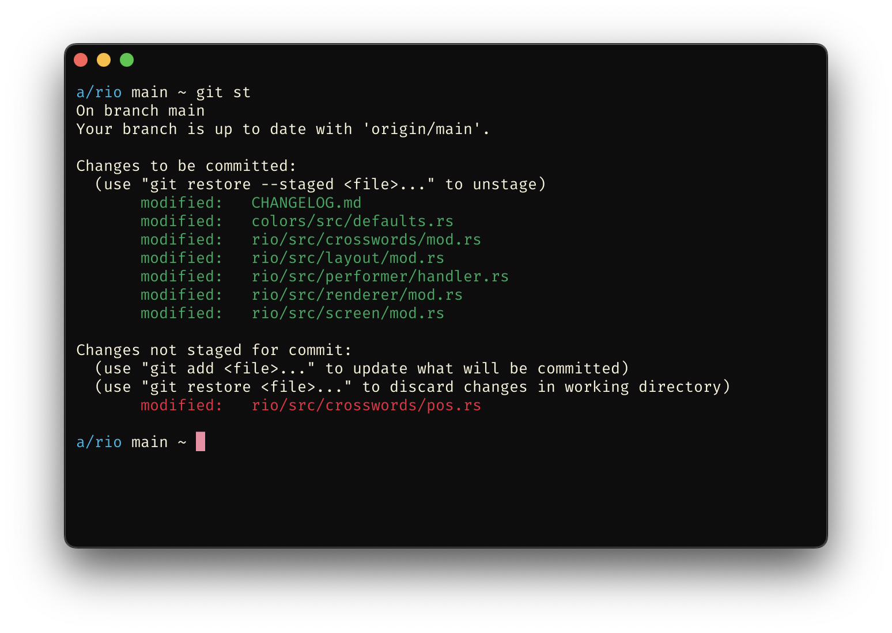

# Rio: ⚡ terminal app 

Website: https://raphamorim.io/rio

This project depends of donations, so if you are using or want to help in any way please consider to donate via [Github Sponsors](https://github.com/sponsors/raphamorim).

- Cross-platform
- Offloads rendering to the GPU for lower system load
- Uses threaded rendering for absolutely minimal latency

#### Status

Basic features are under development for MacOs right now.

| Platform | Development Status |
| --- | --- |
| MacOs | In development 👷 |
| Linux | Not started yet |
| Windows | Not started yet |

Last testing build for macOS (c603bdcffb6c23a137cb491a505dd23e5f6329c5):



#### WPGU based

WPGU is an implementation of WebGPU for use outside of a browser and as backend for firefox's WebGPU implementation. WebGPU allows for more efficient usage of modern GPU's than WebGL. [More info](https://users.rust-lang.org/t/what-is-webgpu-and-is-it-ready-for-use/62331/8)

#### Low CPU and memory usage

You want to avoid a browser-based application to reduce memory and CPU consumption. Electron for example, uses Chromium under the hood so your user sees the same on Windows, Linux and macOS but Rio have same compatibility rendering based on WGPU.

Rio also relies on Rust memory behavior: Rust is a memory-safe language that employs a compiler to track the ownership of values that can be used once and a borrow checker that manages how data is used without relying on traditional garbage collection techniques. [More info](https://stanford-cs242.github.io/f18/lectures/05-1-rust-memory-safety.html)

## Configuration

The configuration should be the following paths otherwise Rio will use the default configuration.

- macOs path: `~/.rio/config.toml`

Example of `config.toml`:

```toml
performance = "High"
height = 400
width = 600
```

### Perfomance

Description: Set terminal WGPU rendering perfomance.

- High: Adapter that has the highest performance. This is often a discrete GPU.
- Low: Adapter that uses the least possible power. This is often an integrated GPU.

See more in https://docs.rs/wgpu/latest/wgpu/enum.PowerPreference.html

```toml
# <performance> Set WGPU rendering perfomance
# default: High
# options: High, Low
# High: Adapter that has the highest performance. This is often a discrete GPU.
# Low: Adapter that uses the least possible power. This is often an integrated GPU.
performance = "High"
```

### Height

Description: Set terminal window height.

```toml
# <height> Set default height
# default: 400
height = 400
```

### Width

Description: Set terminal window width.

```toml
# <width> Set default width
# default: 400
width = 600
```

### Columns

Description: Defines the column width of your console window. This mode is system dependant, and returns an error if you specify a column width that is not supported by your operating system.

```toml
# <width> Set default width
# default: 80 (macOs)
columns = 80
```

### Rows

Description: Define the row height of your console window. This mode is system dependant, and returns an error if you specify a row height that is not supported by your operating system. 

```toml
# <width> Set default width
# default: 25 (macOs)
rows = 25
```

### Colors

- `background` - Set background color.

```toml
[colors]
background = "#151515"
cursor = "#8E12CC"
foreground = "#FFFFFF"
```

### Style

- `font_size` - Set font size.

```toml
[style]
font_size = 16.0
```


## TODO

- [x] pty
- [ ] pty open
- [ ] Render PTY COLS and ROWS based on window size
	- [ ] Tests with VIM
- [ ] Add scroll to text
	- [ ] Ref: https://sotrh.github.io/learn-wgpu/intermediate/tutorial12-camera/#cleaning-up-lib-rs
- [x] WGPU rendering
	- [ ] Render font with custom color, size and family
	- [ ] Fix topbar when resize
	- [ ] Keep rendering with intervals
- [x] Read and use configuration
- [ ] Keyboard input
	- [ ] Alphabet keys (uppercase/lowcase)
	- [x] Numbers keys
	- [ ] Control keys
- [x] Window resizing
- [ ] Allow use set different font-size
- [ ] Themes support
- [ ] Style rendering (italic, bold, underline)
- [ ] Character set

## Reference && Credits

- Grid system was built originally on Alacritty's code https://github.com/alacritty/alacritty/blob/766a3b5582fa8ee13506c0f23c9c145ff0012078/alacritty_terminal/src/grid/mod.rs
- Brass Mono https://github.com/fonsecapeter/brass_mono
- Text mod code is from with https://github.com/hecrj/wgpu_glyph
- https://github.com/wez/wezterm
- https://www.gaijin.at/en/infos/ascii-ansi-character-table#asciicontrol